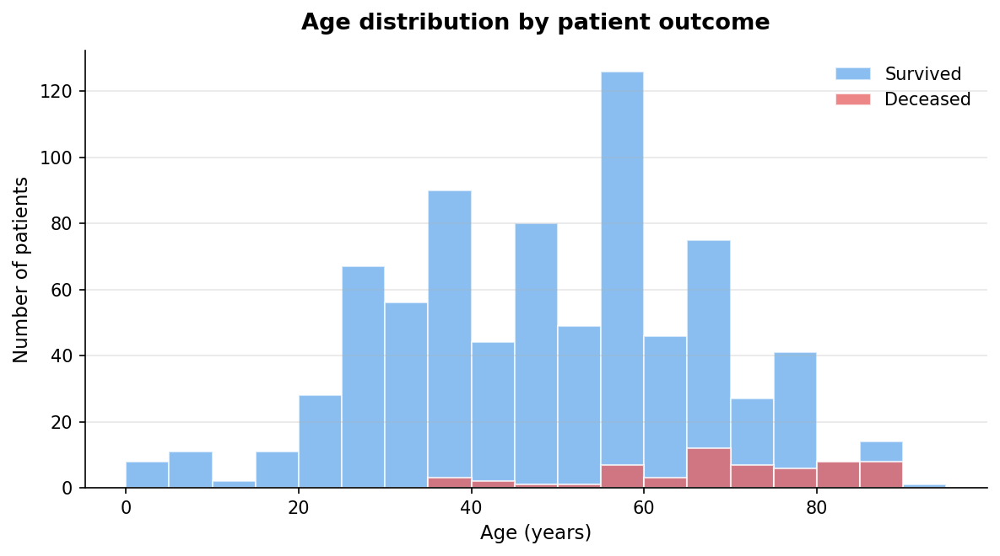
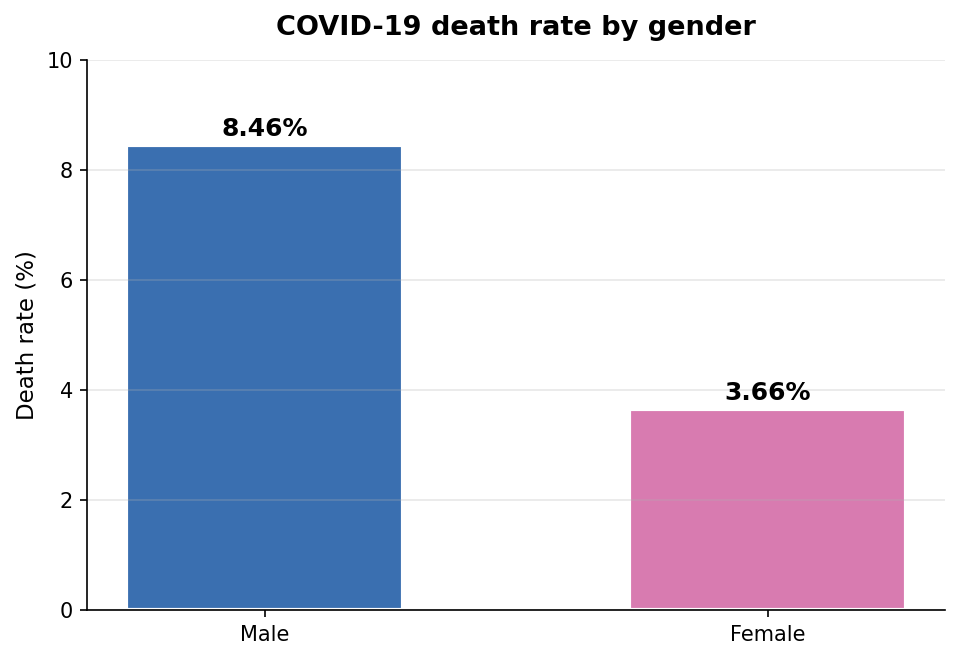

# 📊 Exploratory Analysis of COVID-19 Dataset in R

## 🔍 Project Overview

This project analyses a COVID-19 patient-level line list dataset in R to investigate how **age and gender** influence mortality. Statistical hypothesis testing (Welch's t-test and a two-proportion z-test) is used to validate the findings, and `ggplot2` is used to visualise the results.

---

## 🎯 Objectives

- Calculate the overall COVID-19 death rate in the dataset
- Compare the mean age of deceased vs. surviving patients
- Quantify gender-based differences in mortality
- Apply statistical hypothesis testing to confirm whether observed differences are significant
- Produce visualisations of the key findings

---

## 🧾 Dataset

- **Source:** [COVID-19 Line List Dataset (Kaggle)](https://www.kaggle.com/datasets/sudalairajkumar/novel-corona-virus-2019-dataset)
- **Format:** CSV
- **Size:** 1,085 patient records, 20 fields
- **Key fields used:** `age`, `gender`, `death`, `recovered`

---

## 🛠️ Tools & Technologies

- **R** (base R for statistics)
- **Hmisc** — descriptive statistics via `describe()`
- **ggplot2** — visualisation
- **RStudio** (recommended IDE)

---

## 📈 Analysis Steps

### 1. Data cleaning
- Dropped empty trailing columns from the source CSV
- The `death` column contains a mix of `"0"`, `"1"`, and actual death dates — converted to a binary `death_dummy` variable
- Handled missing values using `na.rm = TRUE`

### 2. Death rate
- Computed overall mortality rate as `sum(death_dummy) / nrow(data)`

### 3. Age analysis
- Compared mean age of deceased vs. survivors
- Applied a Welch's t-test at 99% confidence

### 4. Gender analysis
- Calculated death rate for male and female patients
- Compared groups using both a t-test (quick check) and a two-proportion z-test (`prop.test`), which is more formally correct for a binary outcome

---

## 📊 Key Findings

| Metric | Value |
|---|---|
| Overall death rate | **5.81%** (63 of 1,085 patients) |
| Mean age (deceased) | 68.6 years |
| Mean age (survivors) | 48.1 years |
| Male death rate | 8.46% |
| Female death rate | 3.66% |
| Male-to-female mortality ratio | **2.31×** |
| Age difference p-value | < 0.001 |
| Gender difference p-value | 0.002 |

**Conclusions:**
- Deceased patients are, on average, **~20 years older** than survivors — the difference is highly statistically significant.
- Men have roughly **2.3× the death rate** of women in this dataset, significant at the 99% confidence level.

---

## 🖼️ Visualisations

### Age distribution by patient outcome



The deceased group is concentrated in the 60–85 year age band, while survivors are distributed more broadly across younger ages.

### Death rate by gender



Male patients show more than double the mortality rate of female patients.

---

## ▶️ How to run

```r
# 1. Clone the repository
#    git clone https://github.com/jumma786/Exploratory-Analysis-of-COVID-19-Dataset-in-R.git

# 2. Open the project folder in RStudio and set it as the working directory
#    Session -> Set Working Directory -> To Source File Location

# 3. Run the script (it will install Hmisc and ggplot2 if missing,
#    print all statistics, and re-generate the PNG charts)
source("script.R")
```

---

## 📝 Notes & caveats

- This dataset is a patient-level line list from early in the pandemic. Sample size is small (1,085 records) and skewed toward certain regions, so findings should not be generalised to the global population.
- The gender comparison uses both a t-test and `prop.test()`; the latter is more appropriate for a binary outcome and is reported alongside for transparency.
- Age and gender effects are analysed independently here. A logistic regression with both as predictors would be the natural next step to isolate the contribution of each variable.

---

## 📄 Full report

A detailed Word report covering executive summary, methodology, findings, interpretation, limitations, and recommendations is included in this repository: `COVID19_Analysis_Report.docx`.

---

## 👤 Author

**Jumma Mohammad Teli**
Data Analyst | Power BI · SQL · Python · R

- GitHub: [github.com/jumma786](https://github.com/jumma786)
- LinkedIn: [linkedin.com/in/jumma-mohammad](https://linkedin.com/in/jumma-mohammad)
